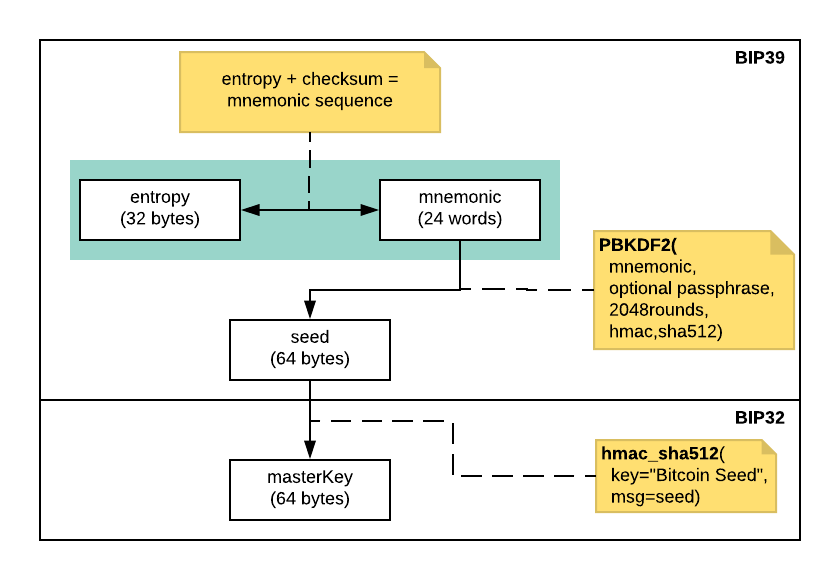
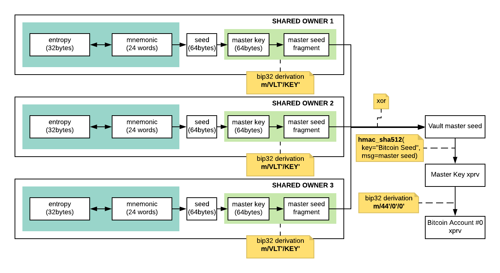

# Vault Seed Recovery

## Build

`docker build -t vault_seed_recovery .`

## Execute

`docker run -ti --rm vault_seed_recovery`

## Description

Master Seed Root Key is provided in xprv format.
It can be used as input in tools such as: <https://iancoleman.io/bip39/>

Bitcoin account #0 is also provided for convenience, it can be used in tools such as <https://electrum.org/> (Standard Wallet > Use a master key).

Note: Ledger vault derives a 512bits seed from shared owners seed fragments. Due to how bip39 is designed it is not possible to go from a seed to its mnemonic representation. As a consequence it is not possible to import this seed in a Ledger Nano S/X.





## Example

```shell
$ docker run -ti --rm vault_seed_recovery
Input each Shared Owner recovery mnemonic (24 words) when requested. End with an empty line.
Shared Owner 1 recovery mnemonic : current mesh depth easily predict gloom find neither come cash useful chief lesson picnic purse hollow pave arena oven quality sight final master bright
Shared Owner 2 recovery mnemonic : innocent tennis pencil hip pistol can now future side action fold topple fancy ride position tide barrel inhale yellow ask slam marriage mixed flas
Invalid 24 words
Shared Owner 2 recovery mnemonic : innocent tennis pencil hip pistol can now future side action fold topple fancy ride position tide barrel inhale yellow ask slam marriage mixed flash
Shared Owner 3 recovery mnemonic : melody material enter gadget elevator harvest pistol tilt bargain athlete erase man raccoon nerve vibrant sister auction tissue depend claim gap room decline feature
Shared Owner 4 recovery mnemonic : 
Master Seed: 606ef87de7809139edbb179de349f0ad31de1aae3fcaea95a1621c48861a64651e1429d0efd862254b014c3941bc67867bd9bf69a07f308a649774552381536b
Master Seed Root Key: xprv9s21ZrQH143K4CPHGVWv5aK15ugeH3KX6SEYDE8fELboo6GXvjuYzXecq794aGxbqBUXevGzZxzqsLS9Kirsk4Y3PABhXD3XiSoqJdBz4EX
Bitcoin account #0 xprv: xprv9xshLXhiFuKV1JYQp6qwPLY1mVPBB4ZQ5dqYw7tcdsDCv5u3Gfqjr7LbHgXhUnTPxkUNW1gXM6C6irDeC9PtHa87dhz12Q1rU6C36nStv8W
```
